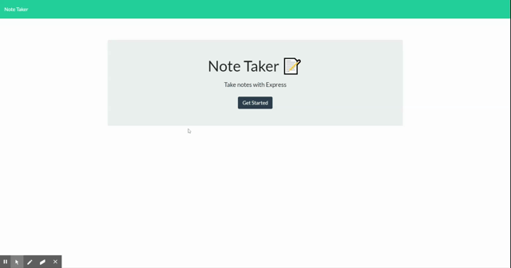

# Note-Taker
by ```Wesley Tejeda```<br>

Repository Link: https://github.com/wesleytejeda/Note-Taker<br>
Heroku Deployed: https://notes-manager-v1.herokuapp.com
## Demo

## Description
In this repository I've created a note editor that is hosted by a server and has routes for different requests such as posting notes and displaying saved notes.

## Installation
Install command: npm install
## Usage
After installing using  the instructions above, use the command ```node server.js``` in order to execute the server. Then go to localhost:8080/ to view index webpage.

## License
[](https://opensource.org/licenses/MIT)

## Contributing
Pull requests are welcome. For suggestions, please open an issue to elaborate changes.

## Questions
You can reach me at the email below for questions or contact me directly on github.

  Wesley Tejeda<br>
  wesley.tejeda95@gmail.com
